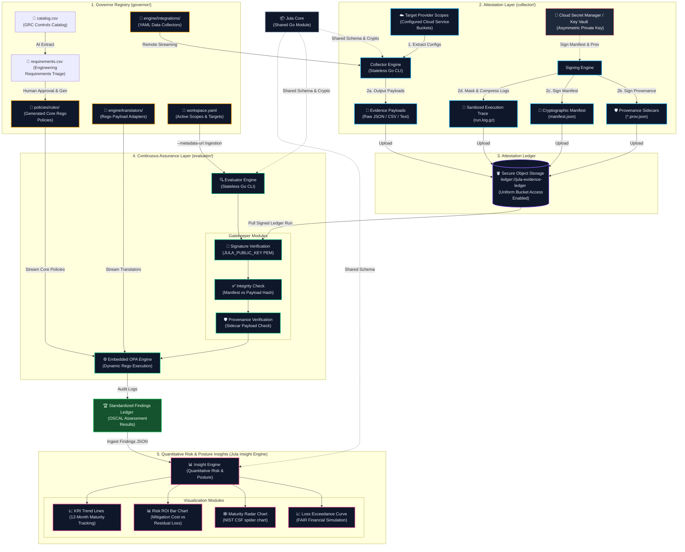

# Jula Controls

**Programmatic Compliance, Attestation, and Continuous Assurance**

| Component | Build & Release | Description |
| :--- | :--- | :--- |
| **[Jula Core](./core)** |  | Shared models and cryptographic utilities |
| **[Jula Collector](./collector)** |  | Stateless Go extraction engine |
| **[Jula Evaluator](./evaluator)** |  | Policy evaluation and manifest verification |
| **[Jula Governor](./governor)** |  | AI Translation & Policy Generation CLI |

## The Jula Controls Ecosystem

Jula Controls is designed as a decoupled, multi-repository architecture (now consolidated into a monorepo) where specialized tools cooperate to automate security assurance:

* The **[Jula Core](./core) defines shared models and cryptographic validation** utilities used by all modules, ensuring consistent data schemas across the pipeline.
* The **[Jula Collector](./collector) extracts configurations** programmatically from cloud APIs and SaaS environments, producing cryptographically signed attestation manifests and raw JSON evidence blobs. The Collector is an ultra-lightweight, stateless network engine running entirely on native Go standard network primitives (`net/http`). Both Cloud hyperscalers and SaaS targets are now defined as pure-text configurations, with cloud targets dynamically authenticated at the edge via the compiled **Frozen Signer Module**.
* The **[Jula Evaluator](./evaluator) evaluates compliance** by consuming those raw artifacts, verifying manifest and provenance signatures, ingesting client configuration metadata, and executing dynamic OPA policies.
* The **[Jula Governor](./governor) stores Rego policies** in a version-controlled directory that serves as the single source of truth for both dynamic resource normalization and compliance scoping rules.

Traditional compliance platforms charge massive premiums for monolithic dashboards, forcing you to adopt heavy, misaligned workflows and endpoint agents. **Jula Controls** is designed to disrupt that model by treating compliance as an engineering problem rather than a dashboard problem.

## The Philosophy: Attestation Engineering vs. Traditional GRC

Of the five core pillars of traditional Governance, Risk, and Compliance (GRC), Jula Controls attacks only two: IT Risk & Compliance (ITRM) and Audit Management.

### What We Attack (The Revenue Blockers)
We focus exclusively on the two pillars that drain engineering sprint velocity and directly block you from passing audits to close enterprise deals. You do not need another shiny dashboard; you need cryptographic proof of your infrastructure. By programmatically extracting evidence directly from your APIs, we create an operational buffer that keeps auditors out of your CI/CD pipeline.

1. **IT Risk & Compliance (ITRM):** Mapping technical controls directly to framework specifications via decoupled, dynamic policy logic.
2. **Audit Management:** Programmatically gathering, hashing, and storing cryptographic evidence.

### What We Intentionally Ignore (Bring Your Own Tools)
Why pay a massive premium for redundant software? Traditional GRCs justify heavy annual contracts by bundling the remaining three pillars, forcing you to migrate workflows into their proprietary systems. We intentionally leave these out to eliminate software overhead, allowing you to leverage the tools your organization already pays for:

* For **policy management**, you do not need a specialized SaaS platform to host an Information Security Policy. Write it in Google Workspace, Notion, or Confluence, and use their native version history and access controls.
* For **third-party risk management**, standardized intake forms routed through existing IT ticketing (Jira or Zendesk) are vastly superior and less noisy than third-party scanning portals.
* For **enterprise risk management**, formal financial risk modeling is overkill for velocity-driven engineering organizations since that risk tracking belongs at the board level.

By pairing this containerized evidence suite with your existing tooling, you eliminate redundant SaaS overhead. Stop wasting time organizing policies in a vendor's portal, and start generating the actual evidence required to pass your audit and close enterprise deals.

---

## Decoupled Architecture: The Attestation & Assurance Paradigm

Jula Controls operates as a decoupled pipeline, cleanly separating raw evidence attestation, governor evaluation, and executive posture visualization.

---

## Licensing

Jula Controls is licensed under the **Business Source License (BSL) 1.1**. See the [LICENSE](./LICENSE) file for full terms.

**Key terms:**

- **Internal, non-commercial use** is permitted with attribution ("Powered by Jula Controls")
- **Rolling Change Date:** Each release converts to Apache License 2.0 four years after publication
- **Expressly prohibited** without an Enterprise License:
  - (a) Use by consultants, MSSPs, or vCISOs to deliver commercial compliance services
  - (b) Hosting as a managed service or embedding in a commercial SaaS/API product
  - (c) Use as training data for AI/ML models or automated code generation tools

For Enterprise License inquiries, contact the Licensor.

