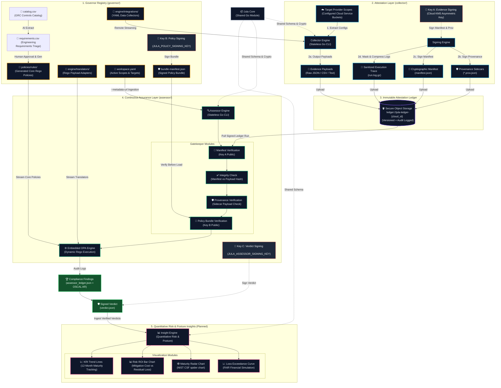

# Jula Controls

**Programmatic Compliance, Attestation, and Continuous Assurance**

| Component | Build & Release | Description |
| :--- | :--- | :--- |
| **[Collector + Assessor + Core](./collector)** |  | Unified build, test, and dual-cloud deploy pipeline |
| **[Governor](./governor)** |  | AI translation, policy generation, and bundle signing |
| **[Core CLI Tools](./core)** |  | `sign-evidence` and `jula-verify` standalone binaries |

| Pipeline | Status | Description |
| :--- | :--- | :--- |
| **Canary** |  | Scheduled daily build and integration smoke test |
| **Release** |  | Multi-platform binary release with SLSA attestation |
| **Self-Heal** |  | AI-driven schema drift remediation |

> For a detailed technical inventory of every feature, see [FEATURES.md](./FEATURES.md).

## The Jula Controls Ecosystem

Jula Controls is designed as a decoupled, multi-repository architecture (now consolidated into a monorepo) where specialized tools cooperate to automate security assurance:

* The **[Jula Core](./core) defines shared models and cryptographic validation** utilities used by all modules, ensuring consistent data schemas across the pipeline. Core also ships two standalone CLI tools: **`sign-evidence`** for signing external evidence payloads with ECDSA provenance sidecars, and **`jula-verify`** for independently auditing the cryptographic chain of any Jula evidence run.
* The **[Jula Collector](./collector) extracts configurations** programmatically from cloud APIs and SaaS environments, producing cryptographically signed attestation manifests and raw JSON evidence blobs. The Collector is an ultra-lightweight, stateless network engine running entirely on native Go standard network primitives (`net/http`). Both Cloud hyperscalers and SaaS targets are now defined as pure-text configurations, with cloud targets dynamically authenticated at the edge via the compiled **Frozen Signer Module**.
* The **[Jula Assessor](./assessor) evaluates compliance** by consuming those raw artifacts, verifying manifest and provenance signatures, ingesting client configuration metadata, and executing dynamic OPA policies. The Assessor optionally produces **NIST OSCAL Assessment Results** JSON output via the `--output-format oscal` flag.
* The **[Jula Governor](./governor) stores Rego policies** in a version-controlled directory that serves as the single source of truth for both dynamic resource normalization and compliance scoping rules.

Traditional compliance platforms charge massive premiums for monolithic dashboards, forcing you to adopt heavy, misaligned workflows and endpoint agents. **Jula Controls** is designed to disrupt that model by treating compliance as an engineering problem rather than a dashboard problem.

## The Philosophy: Attestation Engineering vs. Traditional GRC

Of the five core pillars of traditional Governance, Risk, and Compliance (GRC), Jula Controls attacks only two: IT Risk & Compliance (ITRM) and Audit Management.

### What We Attack (The Revenue Blockers)
We focus exclusively on the two pillars that drain engineering sprint velocity and directly block you from passing audits to close enterprise deals. You do not need another shiny dashboard; you need cryptographic proof of your infrastructure. By programmatically extracting evidence directly from your APIs, we create an operational buffer that keeps auditors out of your CI/CD pipeline.

1. **IT Risk & Compliance (ITRM):** Mapping technical controls directly to framework specifications via decoupled, dynamic policy logic.
2. **Audit Management:** Programmatically gathering, hashing, and storing cryptographic evidence.

### What We Intentionally Ignore (Bring Your Own Tools)
Why pay a massive premium for redundant software? Traditional GRCs justify heavy annual contracts by bundling the remaining three pillars, forcing you to migrate workflows into their proprietary systems. We intentionally leave these out to eliminate software overhead, allowing you to leverage the tools your organization already pays for:

* For **policy management**, you do not need a specialized SaaS platform to host an Information Security Policy. Write it in Google Workspace, Notion, or Confluence, and use their native version history and access controls.
* For **third-party risk management**, standardized intake forms routed through existing IT ticketing (Jira or Zendesk) are vastly superior and less noisy than third-party scanning portals.
* For **enterprise risk management**, formal financial risk modeling is overkill for velocity-driven engineering organizations since that risk tracking belongs at the board level.

By pairing this containerized evidence suite with your existing tooling, you eliminate redundant SaaS overhead. Stop wasting time organizing policies in a vendor's portal, and start generating the actual evidence required to pass your audit and close enterprise deals.

---

## Decoupled Architecture: The Attestation & Assurance Paradigm

Jula Controls operates as a decoupled pipeline, cleanly separating raw evidence attestation, governor evaluation, and executive posture visualization.

---

## Zero Trust Architecture

Jula Controls enforces a zero-trust security model across the entire pipeline. No component implicitly trusts another: every artifact is cryptographically signed, verified, and auditable.

### Cryptographic Trust Chain

Three independent ECDSA P-256 signing keys enforce separation of duties:

| Key | Owner | Purpose | Stored As |
|:----|:------|:--------|:----------|
| **Key A** | Collector | Signs evidence manifests and provenance sidecars | Cloud KMS (asymmetric) |
| **Key B** | Governor | Signs policy bundles before Assessor consumption | `JULA_POLICY_SIGNING_KEY` (GitHub Actions secret) |
| **Key C** | Assessor | Signs compliance verdicts after policy evaluation | `JULA_ASSESSOR_SIGNING_KEY` (GitHub Actions secret) |

No single key can forge artifacts from another component. The Assessor verifies Key A signatures on evidence, Key B signatures on policies, and produces Key C signatures on verdicts.

### Supply Chain Integrity

All build artifacts include [SLSA v1.0 provenance attestations](https://slsa.dev) generated by GitHub's first-party `actions/attest-build-provenance` action:

- **Release binaries:** Darwin/ARM64, Linux/AMD64, Windows/AMD64 (Collector, Assessor, sign-evidence, jula-verify)
- **Container images:** GCP Artifact Registry and AWS ECR (Collector + Assessor)

### Evidence Ledger

Evidence is stored in dual-cloud object storage buckets using a consistent naming convention based on cloud account identifiers:

- **Naming:** `jula-ledger-{cloud_id}` where the ID is the AWS Account ID or GCP Project Number
- **Audit logging:** Each ledger has a companion `jula-ledger-audit-{cloud_id}` bucket for access logs
- **Versioning:** Enabled on both clouds to prevent silent overwrites
- **Lifecycle:** Audit logs rotate after 90 days

### Zero-Knowledge Evidence Handling

Jula Controls never receives, stores, or transits raw client infrastructure data. The Collector and Assessor run exclusively inside the client's environment. Only signed compliance verdicts cross the trust boundary. See [ADR-001](docs/adr/001-zero-knowledge-evidence-handling.md) for the full architectural decision record.

### Egress Enforcement

The `safehttp` package provides SSRF protection and optional egress allowlisting. When `JULA_EGRESS_ALLOWLIST` is set, only approved domains (cloud provider APIs, GitHub) are reachable. Jula-controlled endpoints are blocked by default.

### Minimum-Privilege IAM

Pre-built, importable IAM policies for the Collector with explicit exclusion lists:

- [GCP Collector Permissions](docs/iam-reference/gcp-collector-permissions.md)
- [AWS Collector Permissions](docs/iam-reference/aws-collector-permissions.md)

---

## Licensing

Jula Controls is licensed under the **Business Source License (BSL) 1.1**. See the [LICENSE](./LICENSE) file for full terms.

**Key terms:**

- **Internal, non-commercial use** is permitted with attribution ("Powered by Jula Controls")
- **Rolling Change Date:** Each release converts to Apache License 2.0 four years after publication
- **Expressly prohibited** without an Enterprise License:
  - (a) Use by consultants, MSSPs, or vCISOs to deliver commercial compliance services
  - (b) Hosting as a managed service or embedding in a commercial SaaS/API product
  - (c) Use as training data for AI/ML models or automated code generation tools

For Enterprise License inquiries, contact the Licensor.

