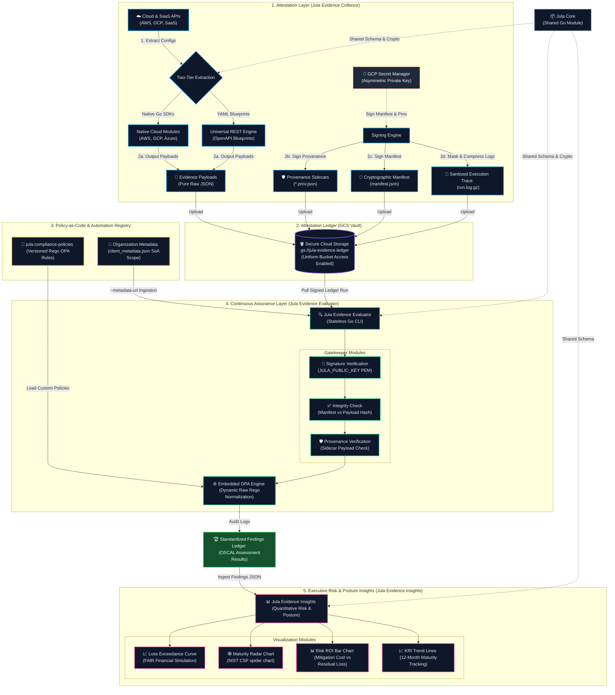

# Jula Controls

**Programmatic Compliance, Attestation, and Continuous Assurance**

| Component | Build & Release | Quality & Tech | License |
| :--- | :--- | :--- | :--- |
| **[Jula Core](https://github.com/alibkaba/jula-core)** | [](https://github.com/alibkaba/jula-core/actions/workflows/main.yml) <br> [](https://github.com/alibkaba/jula-core/releases) | [](https://go.dev/) <br> [](https://goreportcard.com/report/github.com/alibkaba/jula-core) | [](LICENSE) |
| **[Jula Evidence Collector](https://github.com/alibkaba/jula-evidence-collector)** | [](https://github.com/alibkaba/jula-evidence-collector/actions/workflows/main.yml) <br> [](https://github.com/alibkaba/jula-evidence-collector/releases) | [](https://go.dev/) <br> [](https://goreportcard.com/report/github.com/alibkaba/jula-evidence-collector) | [](LICENSE) |
| **[Jula Evidence Evaluator](https://github.com/alibkaba/jula-evidence-evaluator)** | [](https://github.com/alibkaba/jula-evidence-evaluator/actions/workflows/main.yml) <br> [](https://github.com/alibkaba/jula-evidence-evaluator/releases) | [](https://go.dev/) <br> [](https://goreportcard.com/report/github.com/alibkaba/jula-evidence-evaluator) | [](LICENSE) |
| **[Jula Compliance Policies](https://github.com/alibkaba/jula-compliance-policies)** | N/A | [Open Policy Agent (OPA)](https://www.openpolicyagent.org/) <br> Versioned Rego Rules | [](LICENSE) |

## The Jula Controls Ecosystem

Jula Controls is designed as a decoupled, multi-repository architecture where specialized tools cooperate to automate security assurance:

* The **[Jula Evidence Collector](https://github.com/alibkaba/jula-evidence-collector) extracts configurations** programmatically from cloud APIs and SaaS environments, producing cryptographically signed attestation manifests and raw JSON evidence blobs.
* The **[Jula Evidence Evaluator](https://github.com/alibkaba/jula-evidence-evaluator) evaluates compliance** by consuming those raw artifacts, verifying manifest and provenance signatures, ingesting client configuration metadata, and executing dynamic OPA policies.
* The **[Jula Compliance Policies](https://github.com/alibkaba/jula-compliance-policies) stores Rego policies** in a version-controlled repository that serves as the single source of truth for both dynamic resource normalization and compliance scoping rules.

Traditional compliance platforms charge massive premiums for monolithic dashboards, forcing you to adopt heavy, misaligned workflows and endpoint agents. **Jula Controls** is designed to disrupt that model by treating compliance as an engineering problem rather than a dashboard problem.

## The Philosophy: Attestation Engineering vs. Traditional GRC

Of the five core pillars of traditional Governance, Risk, and Compliance (GRC), Jula Controls attacks only two: IT Risk & Compliance (ITRM) and Audit Management.

### What We Attack (The Revenue Blockers)
We focus exclusively on the two pillars that drain engineering sprint velocity and directly block you from passing audits to close enterprise deals. You do not need another shiny dashboard; you need cryptographic proof of your infrastructure. By programmatically extracting evidence directly from your APIs, we create an operational buffer that keeps auditors out of your CI/CD pipeline.

1. **IT Risk & Compliance (ITRM):** Mapping technical controls directly to framework specifications via decoupled, dynamic policy logic.
2. **Audit Management:** Programmatically gathering, hashing, and storing cryptographic evidence.

### What We Intentionally Ignore (Bring Your Own Tools)
Why pay a massive premium for redundant software? Traditional GRCs justify heavy annual contracts by bundling the remaining three pillars, forcing you to migrate workflows into their proprietary systems. We intentionally leave these out to eliminate software overhead, allowing you to leverage the tools your organization already pays for:

* For **policy management**, you do not need a specialized SaaS platform to host an Information Security Policy. Write it in Google Workspace, Notion, or Confluence, and use their native version history and access controls.
* For **third-party risk management**, standardized intake forms routed through existing IT ticketing (Jira or Zendesk) are vastly superior and less noisy than third-party scanning portals.
* For **enterprise risk management**, formal financial risk modeling is overkill for scaling startups since that risk tracking belongs at the board level.

By pairing this containerized evidence suite with your existing tooling, you eliminate redundant SaaS overhead. Stop wasting time organizing policies in a vendor's portal, and start generating the actual evidence required to pass your audit and close enterprise deals.

---

## Decoupled Architecture: The Attestation & Assurance Paradigm

Jula Controls operates as a decoupled pipeline, cleanly separating raw evidence attestation, policy-as-code evaluation, and executive posture visualization.



### 1. [Jula Evidence Collector](https://github.com/alibkaba/jula-evidence-collector) (The Attestation & Extraction Engine)

The Collector programmatically extracts infrastructure configurations using a two-tier strategy: Native Go Modules for major clouds (AWS, GCP, Azure) and a Universal REST Engine executing declarative OpenAPI-inspired YAML blueprints for SaaS tools. Operating as a pure data extraction engine, it outputs raw, untouched API responses directly into files mapped to explicit ERL configuration scopes. It generates SHA-256 hashes of all payloads, signs ECDSA provenance sidecars for each finding, captures execution logs in `run.log.gz`, and signs a secure runtime manifest, proving execution integrity and chain of custody.

### 2. [Jula Evidence Evaluator](https://github.com/alibkaba/jula-evidence-evaluator) (The Assurance Engine)

The Evaluator consumes the cryptographically signed manifests and raw evidence artifacts generated by the Collector. It validates the manifest signature and ingests organization-level scopes or Statement of Applicability configurations via the `--metadata-url` CLI flag. 

Critically, the Evaluator now ingests raw, unflattened, multi-object JSON arrays directly from vendor endpoints inside `input.findings[erl_id][source_id]`. Data normalization has been completely offloaded from Go structures onto the Open Policy Agent (OPA) Rego layer. By leveraging list comprehensions and iterative loops (`some i`), the Rego rules dynamically traverse and shape raw vendor data fields on the fly. This architecture allows the Evaluator to assess technical control compliance dynamically without requiring compiled code changes when vendor APIs shift, outputting standardized Open Security Controls Assessment Language (OSCAL) results.

### 3. [Jula Compliance Policies](https://github.com/alibkaba/jula-compliance-policies) (The Policy-as-Code Registry)

The Policy-as-Code Registry houses version-controlled compliance libraries written in Open Policy Agent (OPA) Rego language. This serves as the single source of truth for both structural data normalization (mapping cloud-specific parameters to agnostic target schemas on the fly) and scoping/applicability rule validation.

### 4. [Jula Core](https://github.com/alibkaba/jula-core) (The Shared Go Library)

The Shared Go Library houses the shared data structures (Finding, Evidence, Manifest) and cryptographic signature signing/verification utilities used across the Jula Attestation and Assurance engines.

### 5. Jula Evidence Insights (Future Analytical Layer)

The future Jula Evidence Insights will ingest the OSCAL Assessment Results generated by the Jula Evidence Evaluator to translate technical security findings into operational maturity tracking and quantitative financial risk metrics for board-level reporting.

---

## The Continuous Compliance Pipeline

1. **Declare:** Define what you want to extract in declarative YAML configuration files (under `configs/blueprints/`). SaaS integrations are defined using OpenAPI-inspired YAML blueprints mapped to target ERL IDs.

2. **Extract & Hash:** The Collector runs queries concurrently. Raw unmodified payloads are saved as `{erl_id}_{provider}_{source_id}.json`. The raw payload is SHA-256 hashed to produce the payload hash.

3. **Sign & Attest:** The Collector generates an ECDSA-signed provenance sidecar (`.prov.json`) for each finding containing the payload hash. It compiles all hashes and the execution trace log (`run.log.gz`) hash into a unified manifest (`manifest.json`) and signs it to generate a cryptographically verifiable attestation of the run.

4. **Verify & Evaluate:** The Evaluator verifies the manifest and provenance signatures using the public key. It indexes raw payloads into an evaluation matrix structured under `input.findings[erl_id][source_id]` and loads customer Statement of Applicability details via `--metadata-url`. It passes this data map to the dynamic Rego helper libraries for normalization and compliance check rule verification.

5. **Analyze & Simulate:** The Jula Evidence Insights engine models enterprise risk exposure and posture maturity using quantitative FAIR simulations and NIST CSF radar maps.

---

## Declarative & Blueprint-Driven Configurations

Jula Controls uses a config-driven schema. Adding new resource checks requires zero Go code changes. You simply add a query or REST specification to a configuration file:

* With **Google Cloud (GCP CAI)**, you define resource discovery scopes and asset filters.
* With **Amazon Web Services (AWS Config)**, you specify SQL queries targeting specific AWS configuration recorders.
* With **SaaS & External APIs**, you map REST configurations using OpenAPI-inspired YAML blueprints (specifying auth flows like oauth2 or bearer, pagination cursors, header schemas, and ERL ID mappings). Virtual query parameters (`jula_erl=`) are automatically supported to permit mapping a single physical endpoint across multiple unique blueprint registry keys.

### Configuration Example (SaaS OpenAPI Blueprint)

```yaml
vendor_name: "github"
base_url: "[https://api.github.com](https://api.github.com)"
auth_flow:
  type: "bearer"
  token_env: "GITHUB_TOKEN"
endpoints:
  "/repos/${GITHUB_ORG}/${GITHUB_REPO}":
    erl_id: "E-CHG-01"
    description: "GitHub Repository Metadata"
    headers:
      Accept: "application/vnd.github.v3+json"
```

---

## Pipeline Validation & Self-Healing Automation

We maintain an automated continuous assurance loop that validates pipeline integrity. If a scheduled canary run fails due to schema variations, our integrated autonomous agent triggers to patch Rego normalizer mapping libraries on the fly.

To trigger an air-gapped E2E validation tracer test locally:
```bash
./automation/autonomous_heal.sh
```

---

## Licensing

Jula Controls is licensed under the Business Source License (BSL 1.1). See the `LICENSE` file for details.