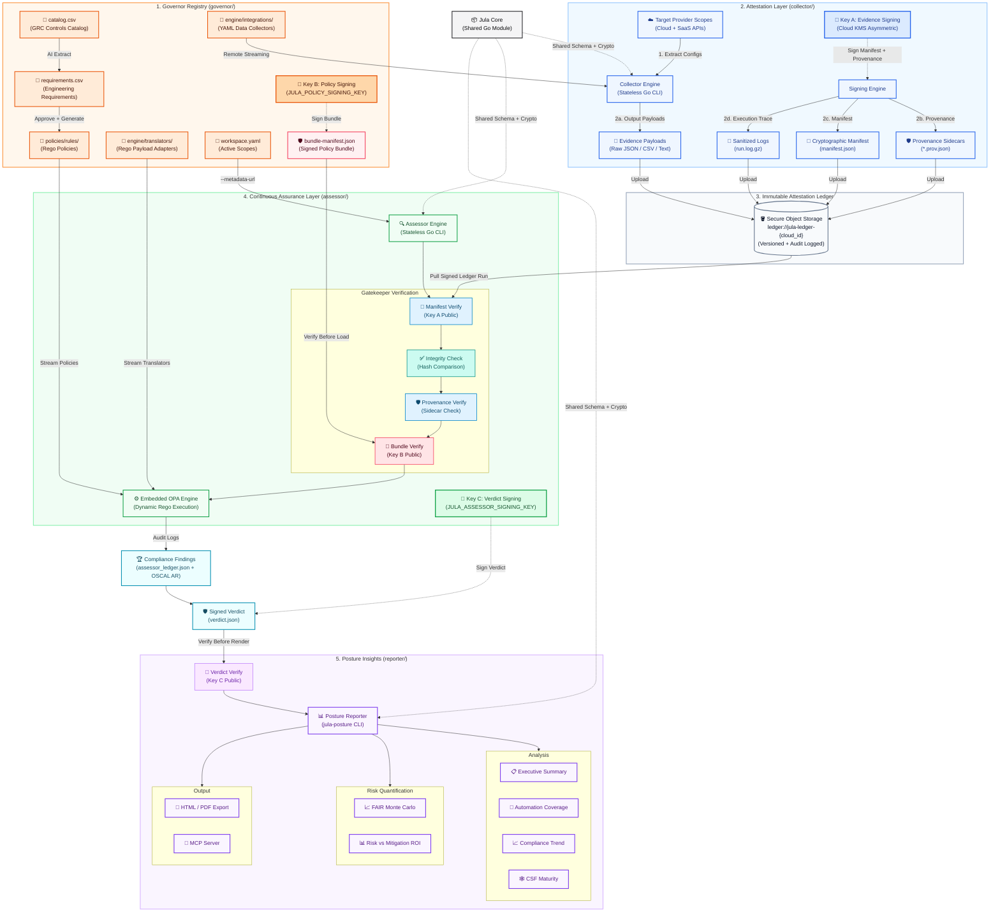

# Jula Controls

**Programmatic Compliance, Attestation, and Continuous Assurance**

| Component | Build & Release | Description |
| :--- | :--- | :--- |
| **[Collector + Assessor + Core](./collector)** |  | Unified build, test, and dual-cloud deploy pipeline |
| **[Governor](./governor)** |  | AI translation, policy generation, and bundle signing |
| **[Reporter](./reporter)** |  | CLI compliance posture reporting (`jula-posture`) |
| **[Core CLI Tools](./core)** |  | `jula-sign-evidence` and `jula-verify` standalone binaries |

| Pipeline | Status | Description |
| :--- | :--- | :--- |
| **Canary** |  | Scheduled daily build and integration smoke test |
| **Release** |  | Multi-platform binary release with SLSA attestation |
| **Self-Heal** |  | AI-driven schema drift remediation |

## The Jula Controls Ecosystem

Jula Controls is a Go workspace of five modules that cooperate to automate security assurance:

* **[Core](./core)** defines shared data models, cryptographic primitives, and three CLI tools: `jula-sign-evidence`, `jula-sign-bundle`, and `jula-verify`.
* **[Collector](./collector)** extracts configurations from cloud APIs and SaaS environments, producing cryptographically signed attestation manifests.
* **[Assessor](./assessor)** verifies evidence signatures, executes OPA Rego policies, and produces signed compliance verdicts (with optional OSCAL output).
* **[Reporter](./reporter)** reads assessment verdicts and renders posture reports via the `jula-posture` CLI: executive summaries, NIST CSF maturity, FAIR risk analysis, ROI visualization, HTML/PDF export, and MCP server integration.
* **[Governor](./governor)** stores Rego policies and uses an AI pipeline to transform compliance catalog prose into machine-executable policy.

Jula treats compliance as an engineering problem rather than a dashboard problem.

## Design Philosophy

Jula is an **assessment integrity engine**, not a GRC platform. It automates a four-stage compliance pipeline:

| Stage | Module | Function |
|:------|:-------|:---------|
| **Translate** | Governor | Compliance catalog prose → executable OPA Rego policy |
| **Collect** | Collector | Cloud/SaaS API configurations → cryptographically signed evidence |
| **Evaluate** | Assessor | Evidence + policy → signed compliance verdicts |
| **Quantify** | Reporter | Verdicts → posture status, maturity scores, FAIR risk analysis |

Every artifact in this pipeline is cryptographically signed. No single key can forge artifacts from another stage.

**What Jula does not cover:** policy document management (use Notion, Confluence), vendor/third-party risk questionnaires (use Jira, Zendesk), and organizational risk registers. These are intentionally excluded to keep the tool focused on the engineering pipeline.

---

## Architecture

Jula operates as a decoupled pipeline, separating evidence attestation, policy evaluation, and posture visualization.

---

## Zero Trust Architecture

Jula Controls enforces a zero-trust security model across the entire pipeline. No component implicitly trusts another: every artifact is cryptographically signed, verified, and auditable.

### Cryptographic Trust Chain

Three independent ECDSA P-256 signing keys enforce separation of duties:

| Key | Owner | Purpose | Stored As |
|:----|:------|:--------|:----------|
| **Key A** | Collector | Signs evidence manifests and provenance sidecars | Cloud KMS (asymmetric) |
| **Key B** | Governor | Signs policy bundles before Assessor consumption | `JULA_POLICY_SIGNING_KEY` (GitHub Actions secret) |
| **Key C** | Assessor | Signs compliance verdicts after policy evaluation | `JULA_ASSESSOR_SIGNING_KEY` (GitHub Actions secret) |

No single key can forge artifacts from another component. The Assessor verifies Key A signatures on evidence, Key B signatures on policies, and produces Key C signatures on verdicts.

### Supply Chain Integrity

All build artifacts include [SLSA v1.0 provenance attestations](https://slsa.dev) generated by GitHub's first-party `actions/attest-build-provenance` action:

- **Release binaries:** Darwin/ARM64, Linux/AMD64, Windows/AMD64 (Collector, Assessor, jula-sign-evidence, jula-verify)
- **Container images:** GCP Artifact Registry and AWS ECR (Collector + Assessor)

### Evidence Ledger

Evidence is stored in dual-cloud object storage buckets using a consistent naming convention based on cloud account identifiers:

- **Naming:** `jula-ledger-{cloud_id}` where the ID is the AWS Account ID or GCP Project Number
- **Audit logging:** Each ledger has a companion `jula-ledger-audit-{cloud_id}` bucket for access logs
- **Versioning:** Enabled on both clouds to prevent silent overwrites
- **Lifecycle:** Audit logs rotate after 90 days

Jula Controls never receives, stores, or transits raw client infrastructure data. The Collector and Assessor run exclusively inside the client's environment. Only signed compliance verdicts cross the trust boundary.

### Egress Enforcement

The `safehttp` package provides SSRF protection and optional egress allowlisting. When `JULA_EGRESS_ALLOWLIST` is set, only approved domains (cloud provider APIs, GitHub) are reachable. Jula-controlled endpoints are blocked by default.

---

## Licensing

Jula Controls is licensed under the **Business Source License (BSL) 1.1**. See the [LICENSE](./LICENSE) file for full terms.

**Key terms:**

- **Production use is permitted**, including within commercial organizations
- **Attribution required:** All generated artifacts must retain "Powered by Jula Controls" visible to the end consumer
- **Rolling Change Date:** Each release converts to Apache License 2.0 four years after publication
- **Expressly prohibited** without an Enterprise License:
  - (a) Use by consultants, MSSPs, or vCISOs to deliver commercial compliance services to their own clients
  - (b) Hosting as a managed service or embedding in a competing commercial SaaS/API product
  - (c) Use as training data for AI/ML models or automated code generation tools

For Enterprise License inquiries, contact the Licensor.

