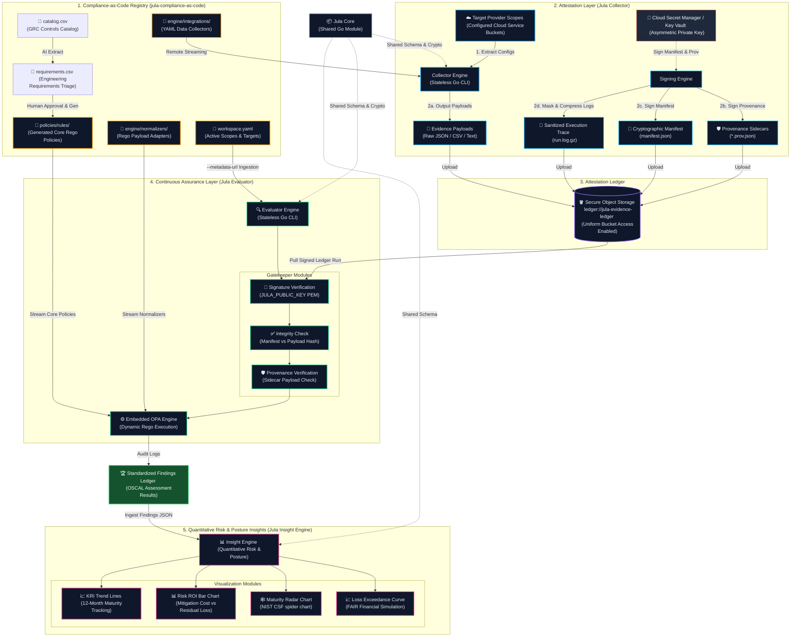

# Jula Controls

**Programmatic Compliance, Attestation, and Continuous Assurance**

| Component | Build & Release | Quality & Tech | License |
| :--- | :--- | :--- | :--- |
| **[Jula Core](https://github.com/alibkaba/jula-core)** | [](https://github.com/alibkaba/jula-core/actions/workflows/main.yml) <br> [](https://github.com/alibkaba/jula-core/releases) | [](https://go.dev/) <br> [](https://goreportcard.com/report/github.com/alibkaba/jula-core) | [](LICENSE) |
| **[Jula Collector](https://github.com/alibkaba/jula-collector)** | [](https://github.com/alibkaba/jula-collector/actions/workflows/main.yml) <br> [](https://github.com/alibkaba/jula-collector/releases) | [](https://go.dev/) <br> [](https://goreportcard.com/report/github.com/alibkaba/jula-collector) | [](LICENSE) |
| **[Jula Evaluator](https://github.com/alibkaba/jula-evaluator)** | [](https://github.com/alibkaba/jula-evaluator/actions/workflows/main.yml) <br> [](https://github.com/alibkaba/jula-evaluator/releases) | [](https://go.dev/) <br> [](https://goreportcard.com/report/github.com/alibkaba/jula-evaluator) | [](LICENSE) |
| **[Jula Compliance-as-Code](https://github.com/alibkaba/jula-compliance-as-code)** | N/A | [Open Policy Agent (OPA)](https://www.openpolicyagent.org/) <br> Versioned Rego Rules | [](LICENSE) |

## The Jula Controls Ecosystem

Jula Controls is designed as a decoupled, multi-repository architecture where specialized tools cooperate to automate security assurance:

* The **[Jula Collector](https://github.com/alibkaba/jula-collector) extracts configurations** programmatically from cloud APIs and SaaS environments, producing cryptographically signed attestation manifests and raw JSON evidence blobs. The Collector is an ultra-lightweight, stateless network engine running entirely on native Go standard network primitives (`net/http`). Both Cloud hyperscalers and SaaS targets are now defined as pure-text configurations, with cloud targets dynamically authenticated at the edge via the compiled **Frozen Signer Module**.
* The **[Jula Evaluator](https://github.com/alibkaba/jula-evaluator) evaluates compliance** by consuming those raw artifacts, verifying manifest and provenance signatures, ingesting client configuration metadata, and executing dynamic OPA policies.
* The **[Jula Compliance-as-Code](https://github.com/alibkaba/jula-compliance-as-code) stores Rego policies** in a version-controlled repository that serves as the single source of truth for both dynamic resource normalization and compliance scoping rules.

Traditional compliance platforms charge massive premiums for monolithic dashboards, forcing you to adopt heavy, misaligned workflows and endpoint agents. **Jula Controls** is designed to disrupt that model by treating compliance as an engineering problem rather than a dashboard problem.

## The Philosophy: Attestation Engineering vs. Traditional GRC

Of the five core pillars of traditional Governance, Risk, and Compliance (GRC), Jula Controls attacks only two: IT Risk & Compliance (ITRM) and Audit Management.

### What We Attack (The Revenue Blockers)
We focus exclusively on the two pillars that drain engineering sprint velocity and directly block you from passing audits to close enterprise deals. You do not need another shiny dashboard; you need cryptographic proof of your infrastructure. By programmatically extracting evidence directly from your APIs, we create an operational buffer that keeps auditors out of your CI/CD pipeline.

1. **IT Risk & Compliance (ITRM):** Mapping technical controls directly to framework specifications via decoupled, dynamic policy logic.
2. **Audit Management:** Programmatically gathering, hashing, and storing cryptographic evidence.

### What We Intentionally Ignore (Bring Your Own Tools)
Why pay a massive premium for redundant software? Traditional GRCs justify heavy annual contracts by bundling the remaining three pillars, forcing you to migrate workflows into their proprietary systems. We intentionally leave these out to eliminate software overhead, allowing you to leverage the tools your organization already pays for:

* For **policy management**, you do not need a specialized SaaS platform to host an Information Security Policy. Write it in Google Workspace, Notion, or Confluence, and use their native version history and access controls.
* For **third-party risk management**, standardized intake forms routed through existing IT ticketing (Jira or Zendesk) are vastly superior and less noisy than third-party scanning portals.
* For **enterprise risk management**, formal financial risk modeling is overkill for scaling startups since that risk tracking belongs at the board level.

By pairing this containerized evidence suite with your existing tooling, you eliminate redundant SaaS overhead. Stop wasting time organizing policies in a vendor's portal, and start generating the actual evidence required to pass your audit and close enterprise deals.

---

## Decoupled Architecture: The Attestation & Assurance Paradigm

Jula Controls operates as a decoupled pipeline, cleanly separating raw evidence attestation, compliance-as-code evaluation, and executive posture visualization.



### 1. [Jula Compliance-as-Code](https://github.com/alibkaba/jula-compliance-as-code) (The Compliance-as-Code Registry)

The Compliance-as-Code Registry houses version-controlled compliance libraries written in Open Policy Agent (OPA) Rego language. This serves as the single source of truth for both structural data normalization (mapping cloud-specific parameters to agnostic target schemas on the fly) and scoping/applicability rule validation.

### 2. [Jula Collector](https://github.com/alibkaba/jula-collector) (The Attestation & Extraction Engine)

The Collector programmatically extracts configurations from active Target Provider Scopes, producing cryptographically signed attestation manifests and raw JSON evidence blobs. The Collector runs a stateless Collector Engine built entirely on native Go primitives.

### 3. [Jula Evaluator](https://github.com/alibkaba/jula-evaluator) (The Assurance Engine)

The Evaluator evaluates compliance by running a stateless Evaluator Engine that consumes those raw ledger artifacts, verifies manifest signatures, and executes dynamic OPA scoping and verification rules.

### 4. [Jula Core](https://github.com/alibkaba/jula-core) (The Shared Go Library)

The Shared Go Library houses the shared data structures (Finding, Evidence, Manifest) and cryptographic signature signing/verification utilities used across the Jula Attestation and Assurance engines.

### 5. Jula Insight Engine (Future Analytical Layer)

The future Jula Insight Engine will ingest the OSCAL Assessment Results generated by the Jula Evaluator to translate technical security findings into operational maturity tracking and quantitative financial risk metrics for board-level reporting.

---

## The Continuous Compliance Pipeline

1. **Declare:** Define what you want to extract in declarative YAML configuration files. Cloud and SaaS integrations are defined using OpenAPI-inspired YAML integrations mapped to target Evidence IDs.

2. **Extract & Hash:** The Collector runs queries concurrently. Raw unmodified payloads are saved as `{evidence_id}_{provider}_{source_id}.json`. The raw payload is SHA-256 hashed to produce the payload hash.

3. **Sign & Attest:** The Collector generates an ECDSA-signed provenance sidecar (`.prov.json`) for each finding containing the payload hash. It compiles all hashes and the execution trace log (`run.log.gz`) hash into a unified manifest (`manifest.json`) and signs it to generate a cryptographically verifiable attestation of the run.

4. **Verify & Evaluate:** The Evaluator verifies the manifest and provenance signatures using the public key. It indexes raw payloads into an evaluation matrix structured under `input.findings[evidence_id][source_id]` and loads customer Statement of Applicability details via `--metadata-url`. It passes this data map to the dynamic Rego helper libraries for normalization and compliance check rule verification.

5. **Analyze & Simulate:** The Jula Insights engine models enterprise risk exposure and posture maturity using quantitative FAIR simulations and NIST CSF radar maps.

---

## Flag & Configuration Usage

The engine supports robust configuration scoping via local directories or remote stream injections.
- **Local Directory:** Use the `JULA_INTEGRATION_DIR` environment variable (or `--integration-dir` CLI flag), which defaults to `"integrations"`. The engine traverses `integrations/universal_cloud/` and `integrations/universal_rest/` to parse targets.
- **Remote Streaming:** Use the `--integration-url` flag (or `JULA_INTEGRATION_URL` environment fallback) to pass a remote target. The engine fetches an `integrations.tar.gz` archive, decompresses it natively via `compress/gzip` and `archive/tar`, and inflates the configurations directly into a thread-safe in-memory map for scratch-container execution without ever touching the disk.

## Declarative & Integration-Driven Configurations

Jula Controls uses a config-driven schema. Adding new resource checks requires zero Go code changes. You simply add a query or REST specification to a configuration file:

* Cloud hyperscalers and SaaS targets are both defined via text-based YAML integrations.
* They map REST configurations using OpenAPI-inspired schemas specifying auth flows like `aws_sigv4`, `gcp_adc`, `oauth2`, or `bearer`.
* Support pagination cursors, header schemas, and Evidence ID mappings. Virtual query parameters (`jula_evidence=`) are automatically supported to permit mapping a single physical endpoint across multiple unique integration registry keys.

### Configuration Example (Cloud POST-Driven Integration)

```yaml
vendor_name: "aws"
provider: "aws"
auth_flow:
  type: "aws_sigv4"
endpoints:
  "https://config.${AWS_REGION}.amazonaws.com/":
    method: "POST"
    evidence_id: "EVID-IAM-01"
    description: "Query IAM Users via AWS Config REST gateway"
    body:
      Expression: "SELECT resourceId WHERE resourceType = 'AWS::IAM::User'"
```

---

## Pipeline Validation & Self-Healing Automation

We maintain an automated continuous assurance loop that validates pipeline integrity. If a scheduled canary run fails due to schema variations, our integrated autonomous agent triggers to patch Rego normalizer mapping libraries on the fly.

To trigger an air-gapped E2E validation tracer test locally:
```bash
./automation/autonomous_heal.sh
```

---

## Roadmap

The current ecosystem provides a robust, decoupled architecture for continuous compliance, but deploying it requires manual setup. Upcoming roadmap priorities focus on simplifying the adoption and operational overhead of the Jula suite:

* **[ ] IaC Deployment Templates:** Create unified Infrastructure as Code (IaC) deployment packages (e.g., Terraform modules, AWS CloudFormation templates, Azure Resource Manager templates, or GCP Deployment Manager manifests) to allow users to spin up the entire Collector and Evaluator pipeline with a single command.

---

## Licensing

Jula Controls is licensed under the Business Source License (BSL 1.1). See the `LICENSE` file for details.