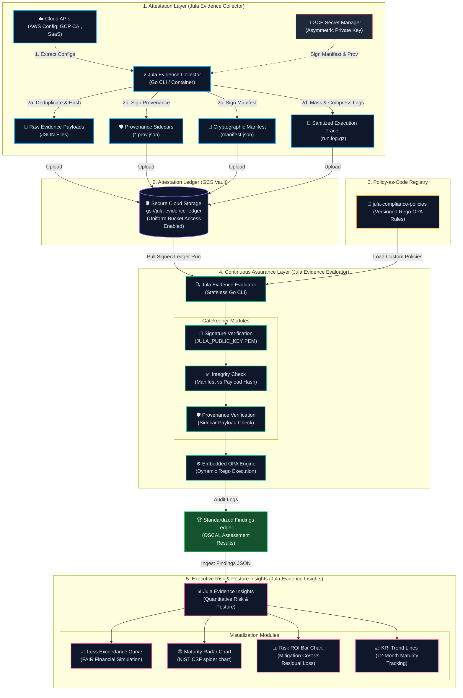

# Jula Controls

**Programmatic Compliance, Attestation, and Continuous Assurance**

| Component | Build & Release | Quality & Tech | License |
| :--- | :--- | :--- | :--- |
| **[Jula Evidence Collector](https://github.com/alibkaba/jula-evidence-collector)** | [](https://github.com/alibkaba/jula-evidence-collector/actions/workflows/main.yml) <br> [](https://github.com/alibkaba/jula-evidence-collector/releases) | [](https://go.dev/) <br> [](https://goreportcard.com/report/github.com/alibkaba/jula-evidence-collector) | [](LICENSE) |
| **[Jula Evidence Evaluator](https://github.com/alibkaba/jula-evidence-evaluator)** | [](https://github.com/alibkaba/jula-evidence-evaluator/actions/workflows/main.yml) <br> [](https://github.com/alibkaba/jula-evidence-evaluator/releases) | [](https://go.dev/) <br> [](https://goreportcard.com/report/github.com/alibkaba/jula-evidence-evaluator) | [](LICENSE) |
| **[Jula Compliance Policies](https://github.com/alibkaba/jula-compliance-policies)** | N/A | [Open Policy Agent (OPA)](https://www.openpolicyagent.org/) <br> Versioned Rego Rules | [](LICENSE) |

## The Jula Controls Ecosystem

Jula Controls is designed as a decoupled, multi-repository architecture where specialized tools cooperate to automate security assurance:

* The **[Jula Evidence Collector](https://github.com/alibkaba/jula-evidence-collector) extracts configurations** programmatically from cloud APIs and SaaS environments, producing cryptographically signed attestation manifests and raw JSON evidence.
* The **[Jula Evidence Evaluator](https://github.com/alibkaba/jula-evidence-evaluator) evaluates compliance** by consuming those signed manifests, validating their signature, and executing OPA rules against the ingested payloads to generate audit findings.
* The **[Jula Compliance Policies](https://github.com/alibkaba/jula-compliance-policies) stores Rego policies** in a version-controlled repository that serves as the single source of truth for the evaluation logic.


Traditional compliance platforms charge massive premiums for monolithic dashboards, forcing you to adopt heavy, misaligned workflows and endpoint agents. **Jula Controls** is designed to disrupt that model by treating compliance as an engineering problem rather than a dashboard problem.

## The Philosophy: Attestation Engineering vs. Traditional GRC

Of the five core pillars of traditional Governance, Risk, and Compliance (GRC), Jula Controls attacks only two: IT Risk & Compliance (ITRM) and Audit Management.

### What We Attack (The Revenue Blockers)
We focus exclusively on the two pillars that drain engineering sprint velocity and directly block you from passing audits to close enterprise deals. You do not need another shiny dashboard; you need cryptographic proof of your infrastructure. By programmatically extracting evidence directly from your APIs, we create an operational buffer that keeps auditors out of your CI/CD pipeline.

1. **IT Risk & Compliance (ITRM):** Mapping technical controls directly to framework specifications.
2. **Audit Management:** Programmatically gathering, hashing, and storing cryptographic evidence.

### What We Intentionally Ignore (Bring Your Own Tools)
Why pay a massive premium for redundant software? Traditional GRCs justify heavy annual contracts by bundling the remaining three pillars, forcing you to migrate workflows into their proprietary systems. We intentionally leave these out to eliminate software overhead, allowing you to leverage the tools your organization already pays for:

* For **policy management**, you do not need a specialized SaaS platform to host an Information Security Policy. Write it in Google Workspace, Notion, or Confluence, and use their native version history and access controls.
* For **third-party risk management**, standardized intake forms routed through existing IT ticketing (Jira or Zendesk) are vastly superior and less noisy than third-party scanning portals.
* For **enterprise risk management**, formal financial risk modeling is overkill for scaling startups since that risk tracking belongs at the board level.

By pairing this containerized evidence suite with your existing tooling, you eliminate redundant SaaS overhead. Stop wasting time organizing policies in a vendor's portal, and start generating the actual evidence required to pass your audit and close enterprise deals.

---

## Decoupled Architecture: The Attestation & Assurance Paradigm

Jula Controls operates as a decoupled pipeline, cleanly separating raw evidence attestation, policy-as-code evaluation, and executive posture visualization.



### 1. [Jula Evidence Collector](https://github.com/alibkaba/jula-evidence-collector) (The Attestation Engine)

The Collector programmatically extracts infrastructure configurations from multiple cloud environments and SaaS tools, generates SHA-256 hashes of the raw payloads, and outputs an immutable set of evidence files. It also captures the complete execution log, masks sensitive credentials, compresses it into `run.log.gz`, and signs a secure runtime manifest containing all hashes, proving that the raw evidence was collected at a specific timestamp, the run completed successfully, and no files have been altered.

### 2. [Jula Evidence Evaluator](https://github.com/alibkaba/jula-evidence-evaluator) (The Assurance Engine)

The Evaluator consumes the cryptographically signed manifests and raw evidence artifacts generated by the Collector. It validates the manifest signature and parses the evidence against standardized Open Security Controls Assessment Language (OSCAL) schemas to evaluate technical control adherence and generate audit-ready assurance files.

### 3. [Jula Compliance Policies](https://github.com/alibkaba/jula-compliance-policies) (The Policy-as-Code Registry)

The Policy-as-Code Registry houses version-controlled compliance policies written in Open Policy Agent (OPA) Rego language. This serves as the single source of truth for the OPA engine embedded within the **Jula Evidence Evaluator** to execute verification rules and determine compliance status.

### 4. Jula Evidence Insights (Future Analytical Layer)

The future Jula Evidence Insights will ingest the OSCAL Assessment Results generated by the Jula Evidence Evaluator to translate technical security findings into operational maturity tracking and quantitative financial risk metrics for board-level reporting.

---

## The Continuous Compliance Pipeline

1. **Declare:** Define what you want to extract in declarative YAML configuration files. Each entry maps an Evidence Request List (ERL) ID to a cloud-native query or SaaS endpoint.

2. **Extract & Hash:** The Collector runs queries concurrently across AWS, GCP, and SaaS APIs. Each raw payload is SHA-256 hashed. The hash becomes the filename, guaranteeing perfect data deduplication.

3. **Sign & Attest:** The Collector compiles all raw evidence hashes and the execution trace log (`run.log.gz`) hash into a unified manifest and signs it using an asymmetric private key, generating a cryptographically verifiable attestation of the run.

4. **Verify & Evaluate:** The Evaluator verifies the manifest signature using the corresponding public key and processes the evidence against target compliance rules to produce automated pass/fail results.

5. **Analyze & Simulate:** The Jula Evidence Insights engine models enterprise risk exposure and posture maturity using quantitative FAIR simulations and NIST CSF radar maps.

---

## Declarative Multi-Cloud Configurations

Jula Controls uses a config-driven schema. Adding new resource checks requires zero Go code changes. You simply add a SQL query or REST specification to a configuration file:

* With **Google Cloud (GCP CAI)**, you define resource discovery scopes and asset filters.
* With **Amazon Web Services (AWS Config)**, you specify SQL queries targeting specific AWS configuration recorders.
* With **SaaS & External APIs**, you map generic HTTP REST/GraphQL configurations to target APIs with OAuth2 authentication.

### Configuration Example (AWS S3 Bucket Rule)

```yaml
E-DCH-10:
  description: "S3 Bucket Configurations"
  provider: "aws_config"
  query: "SELECT resourceId, resourceType, configuration, tags WHERE resourceType = 'AWS::S3::Bucket'"
```

---

## Licensing

Jula Controls is licensed under the Business Source License (BSL 1.1). See the `LICENSE` file for details.
